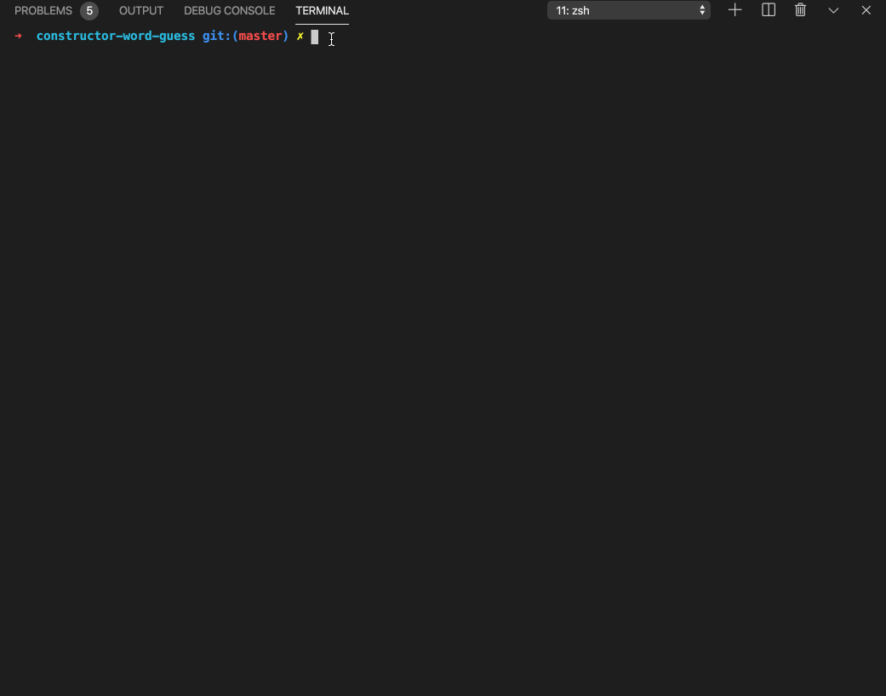
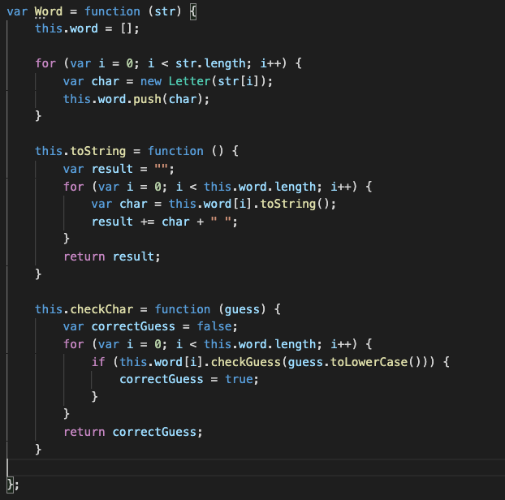

# Constructor Word Guess
A Word Guess command-line game. This is the node version of the classic word game Hangman, where the computer chooses a random secret word from an array of possible words, and the other player tries to guess the word by guessing what letters it contains. Every wrong guess brings them one step closer to losing.

## Technologies used
* JavaScript
    * Constructor functions
* Node.js
* Inquirer.js npm package
* Command-line interface

## Demonstration GIF

## Essential Code

This constructor is used to create an object representing the current word the user is attempting to guess. 

The function `toString` returns a string representing the word.
The function `checkChar` takes in the user guess as a parameter and checks if the secret word contains that character.

## Links
[LinkedIn](https://www.linkedin.com/in/leticiaroncero/?locale=en_US)
